# 🍽️ Swiggy Clone using Live API

> React, Redux, SPA

Developed a frontend clone of Swiggy using React as a Single Page Application (SPA). Integrated Swiggy’s public API to deliver a dynamic, real-time food ordering interface.

- Used real-time API to fetch restaurant/menu data — no hardcoded content.
- Implemented async data fetching with **async/await** for smooth rendering.
- Bypassed CORS using a custom proxy server to modify request headers.
- Built seamless SPA routing with **react-router-dom**.
- Managed global cart state using Redux for real-time UI updates.
- Added in-restaurant dish search using live filtering on local array.
- Included Veg/Non-Veg filters via toggle control.  

---

## **HOME PAGE**

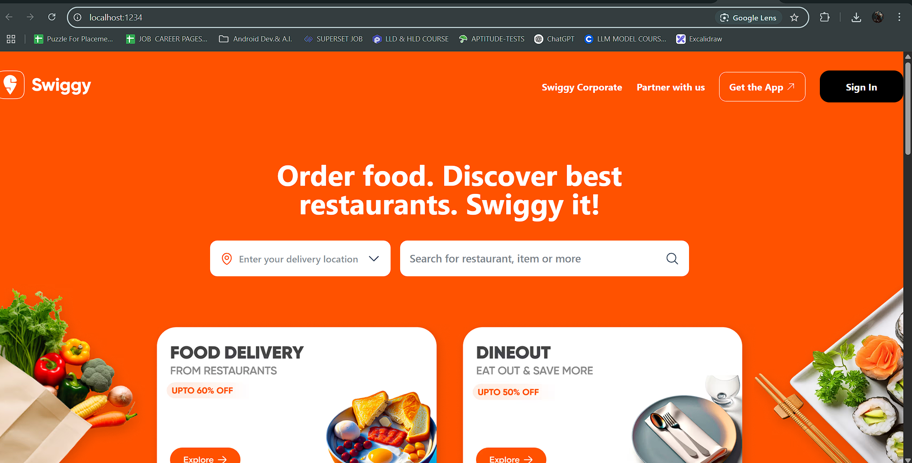

---

## **HOMEPAGE**

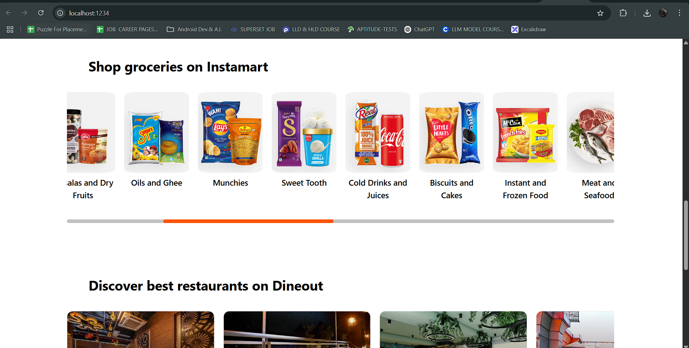

---

## **HOMEPAGE**

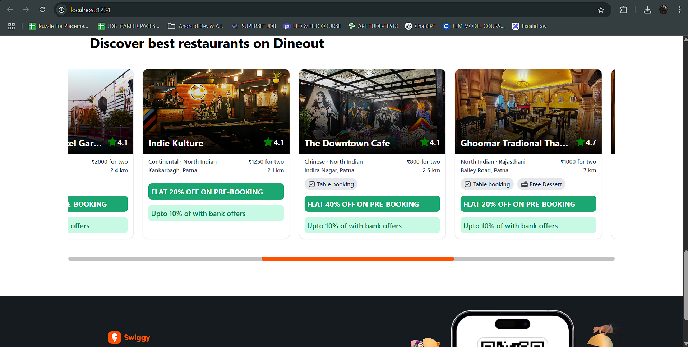

---

## **HOMEPAGE (TABLET VIEW)**

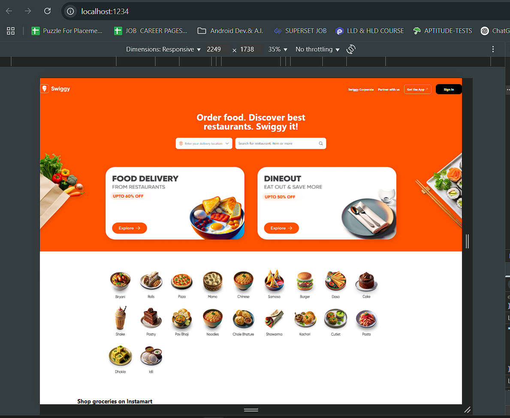

---

## **HOMEPAGE (Mobile VIEW)**

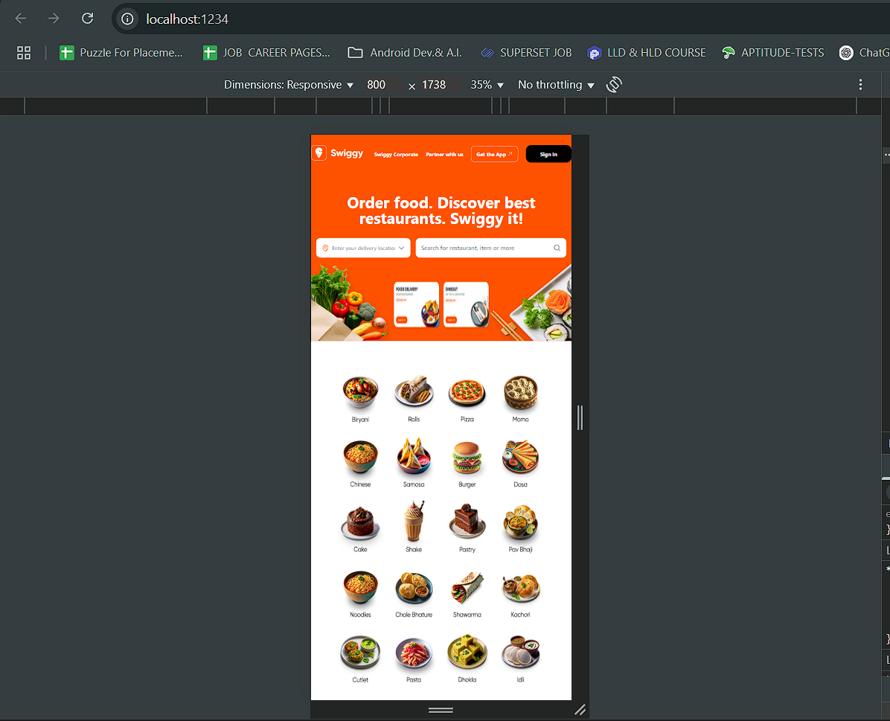

---

## **HOMEPAGE (Mobile VIEW)**

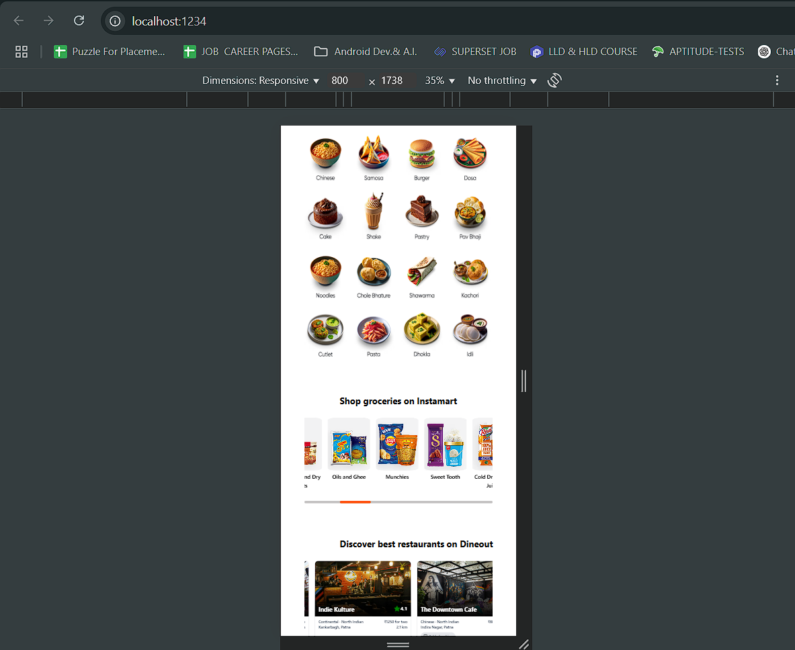

---

## **SHIMMER EFFECT IN (FOOD DELIVERY SECTION)**

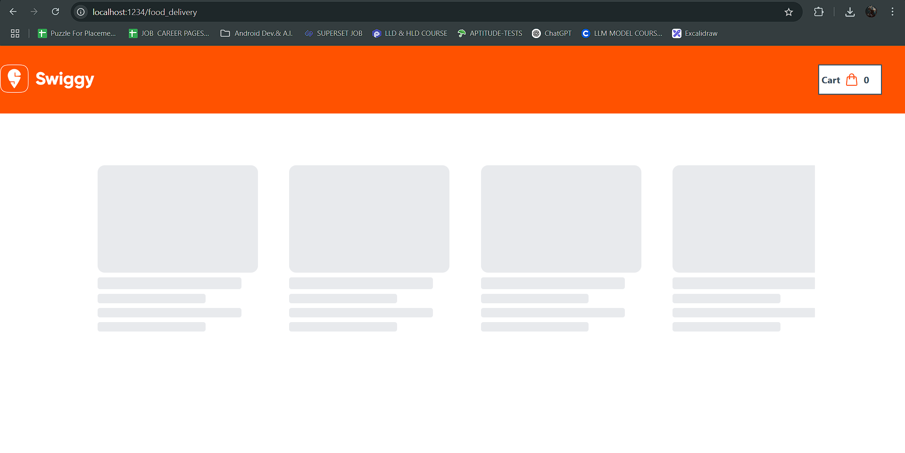

---

## **DATA FETCHED FROM SWIGGY LIVE API IN FOOD DELIVERY SECTION**

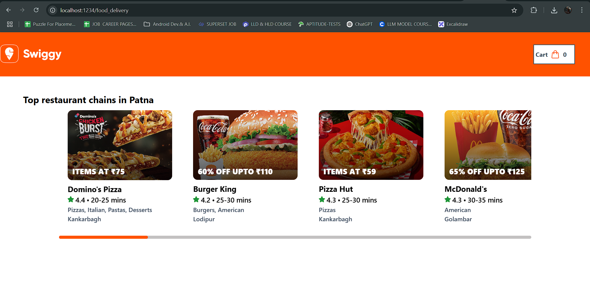

---

## **OPENED PIZZA HUT FROM FOOD DELIVERY SECTION AND ADDED ITEM TO CART**

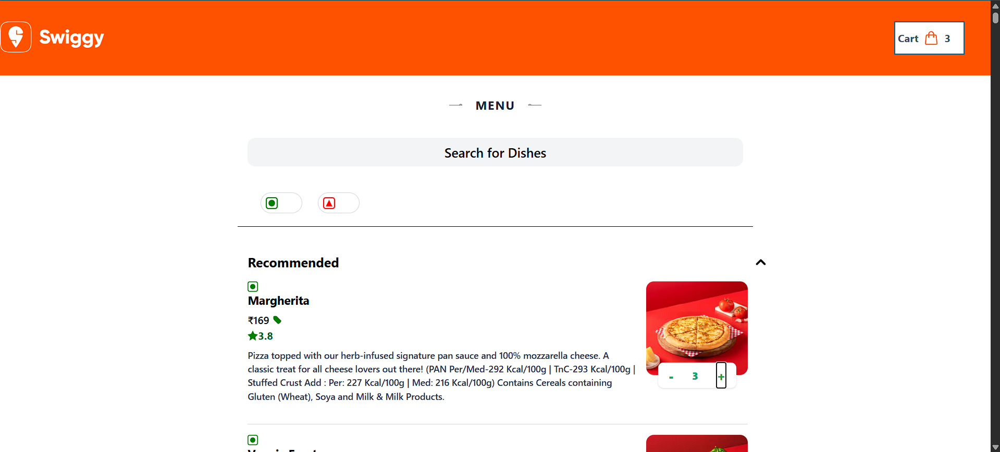

---

## **CART SECTION DISPLAYING TOTAL COST**

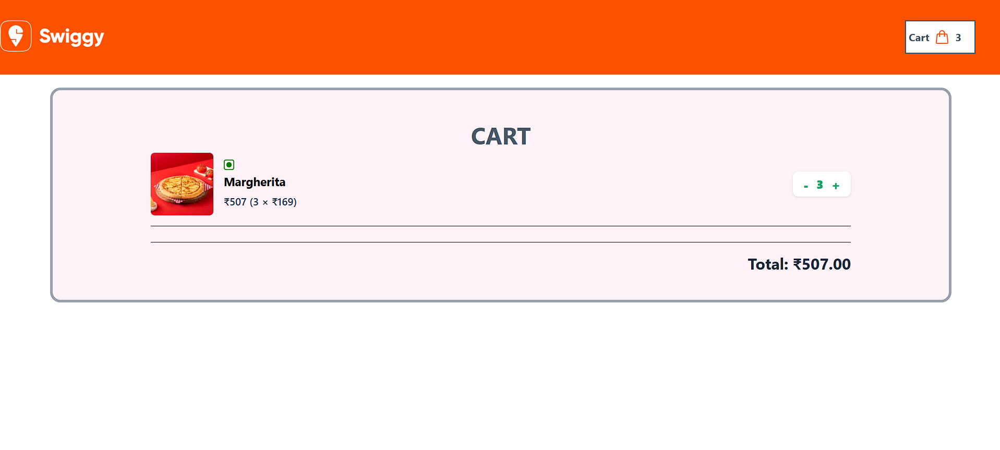

---

## **NAVIGATING BACK TO WEBSITE AND APPLYING NON-VEG FILTER, CART STILL HOLDS THE VALUE (GLOBAL STATE USED)**

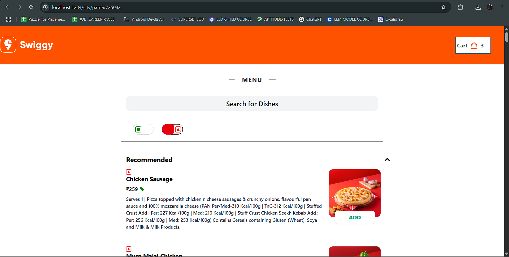

---
> 🎥 **Note:** A demo video was recorded to showcase the project functionality. However, due to OBS recording quality issues, the final output did not meet expectations.

